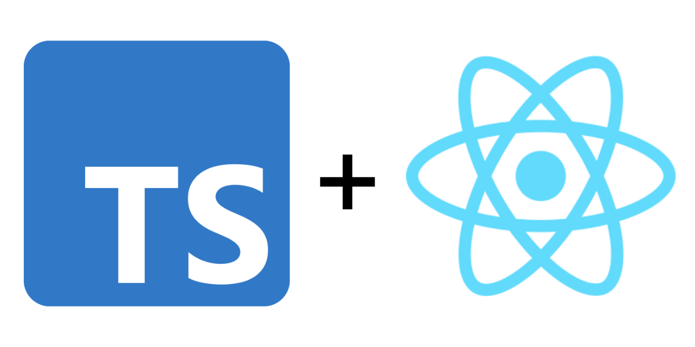

### Hi dear 👋, I`m Guilherme Gatti

  
  

 

- :rocket: Skills: <strong>JavaScript | React.js | Next.js | Node.js | Docker | Testing</strong>

<!--
**guigattidev/guigattidev** is a ✨ _special_ ✨ repository because its `README.md` (this file) appears on your GitHub profile.

Here are some ideas to get you started:

- 🔭 I’m currently working on ...
- 🌱 I’m currently learning ...
- 👯 I’m looking to collaborate on ...
- 🤔 I’m looking for help with ...
- 💬 Ask me about ...
- 📫 How to reach me: ...
- 😄 Pronouns: ...
- ⚡ Fun fact: ...
-->
